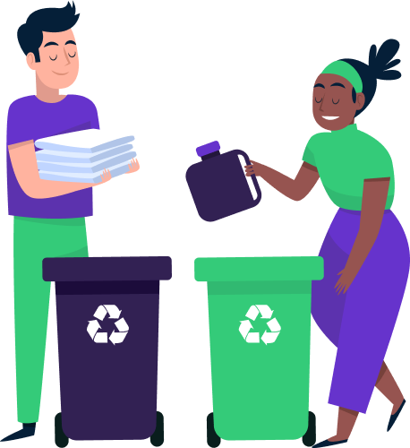

<div align="center">
    <h1>Ecoleta</h1>
    
</div>

Improve the waste separation _Mülltrennung_ in :de: by creating recyclable garbage collection points and show them in a map, so that people can easily find a collect point and bring their garbage there, making the world better.

<div align="center">
    
</div>

### :information_source: How To Use

#### Server

```bash

$ cd server

$ npm install

$ npm run knex:migrate

$ npm run knex:seed

$ npm run dev
```

###### Run it with Docker

```bash
$ cd server

$ docker-compose up --build -d
```

#### Web

```bash

$ cd web

$ yarn

$ yarn start
```

#### Mobile

```bash

$ cd mobile

$ yarn

$ yarn start
```
